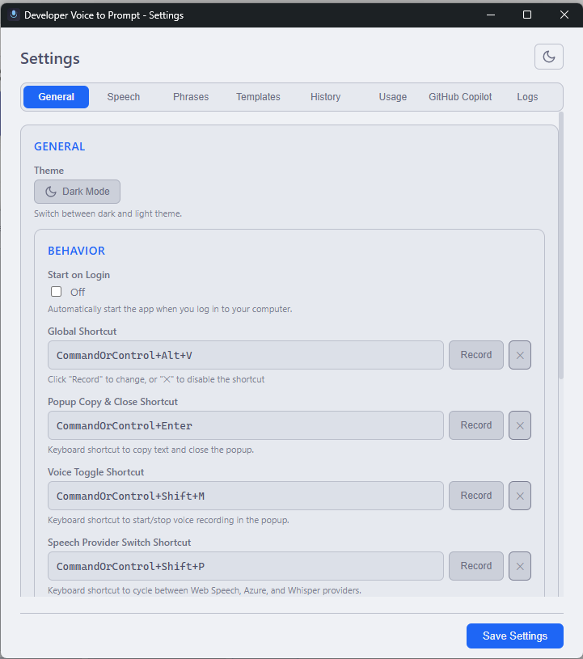
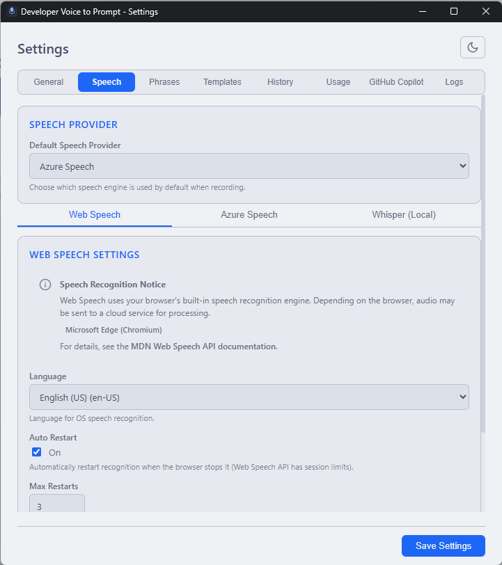
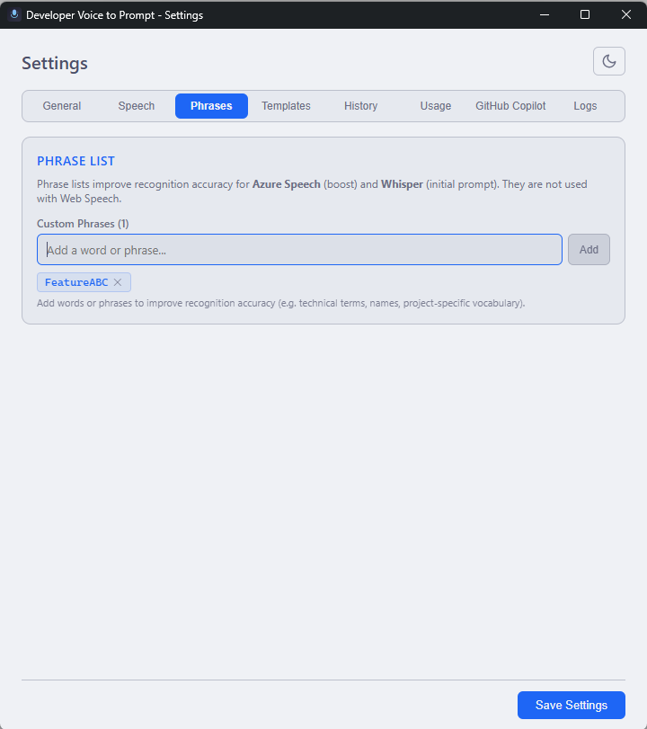
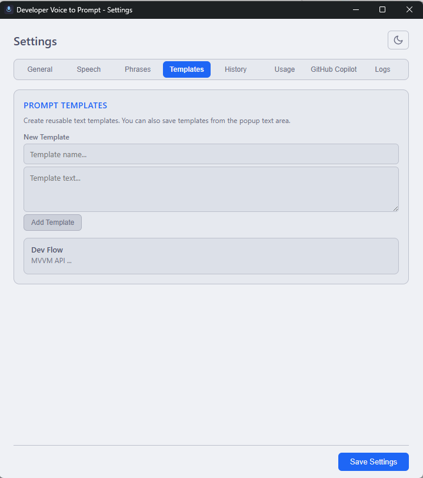
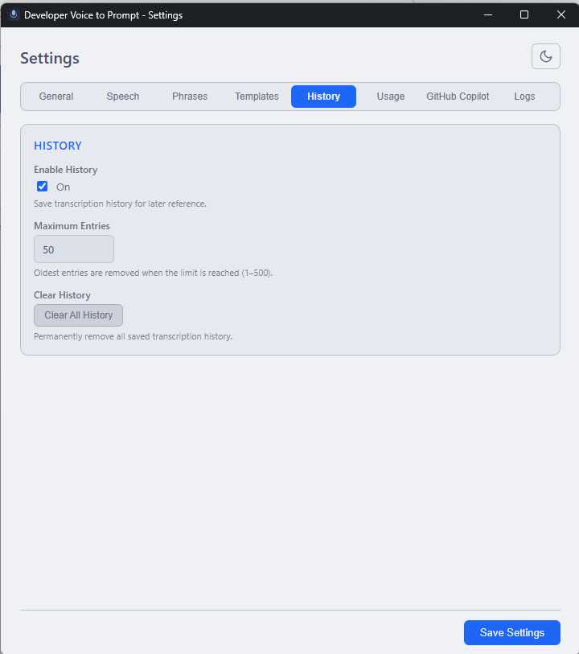
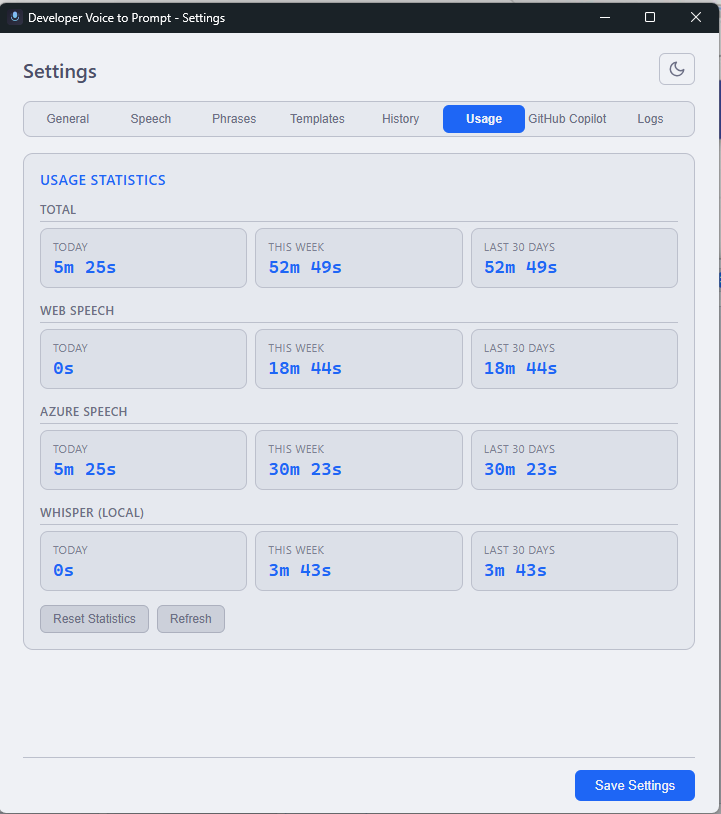

# Developer Voice to Prompt

**Turn spoken thoughts into structured AI prompts — right from your desktop.**

Developers think faster than they type. Voice-to-text inside AI tools behaves differently everywhere, and some tools have no voice support at all. Typing prompts often feels like coding without IntelliSense.

Developer Voice to Prompt is a lightweight tray application that lets you **speak naturally, edit live, structure your thoughts, and generate optimized prompts** for any AI tool.

## The Problem

Every AI tool handles text input differently. Some have built-in voice. Most don't. And when they do, the experience is inconsistent — different accuracy, different languages, different behavior.

Meanwhile, developers are spending more time than ever writing prompts. Typing them out manually is slow, repetitive, and breaks the flow of thinking.

**There's IntelliSense for code. There should be IntelliSense for prompting.**
> **Vision**
>
> Bring IntelliSense-level speed and clarity to prompting—so developers can capture ideas, structure context, and communicate with AI at the speed of thought.
---

## How Developer Voice to Prompt Solves This

This tool gives developers a **consistent, voice-first workflow** that works independently of any AI tool.

Speak your idea. Edit it live. Load a **custom template** that already contains your context and format, then move the cursor to the parts you want to change and **fill them in with your voice**.

This makes it easy to reuse the same structure while quickly adapting it to a **specific scenario**—for example adding a new feature, referencing exact files, or naming tools the AI should call.

All prompts are also stored in a **history**, independent of the AI tool you use. This gives you one place to review, reuse, or refine prompts across different tools.

No more switching between voice tools.  
No more retyping the same things.  
More context + more specificity ⇒ better results :rocket:


---

## Feature Highlights

### Speak and Edit Live

<a href="doc/images/MainWindow.png"></a>

Start speaking — the transcript appears in real time. Pause, edit the text, then continue speaking. The transcript picks up right where you left off.

No need to stop the microphone. No need to restart. Your edits and new speech merge seamlessly.

<a href="doc/images/MainWindowRecording.png"></a>

---

### Prompt Templates

Save reusable context blocks as templates and insert them with one click. This eliminates the need to rewrite the same setup instructions for every prompt.

Templates are useful for architecture reviews, bug analysis, refactoring instructions, agent workflows, or any prompt structure you use repeatedly.

The key advantage is that templates can be quickly **edited via voice** before sending them to your AI tool. Instead of rewriting the whole prompt, you simply add or adjust details for the current situation.

Typical things you may customize inside a template include:
- File names
- Project names
- Specific components or modules
- MCP tool names
- Skill or agent names the AI should use

This is especially helpful because many AI tools search your codebase. Providing **exact file names, tools, or skills** increases the chance that the AI targets the correct parts of your project.

Voice editing is intended for **quick additions or adjustments**, not for rebuilding the template. You can jump to specific sections with the cursor and dictate the missing details directly into the template.

<a href="doc/images/MainWindowTemplates1.png"></a>
<a href="doc/images/MainWindowTemplates2.png"></a>

---

### AI-Powered Prompt Enhancement

Connect to **GitHub Copilot** and transform raw spoken thoughts into structured, optimized prompts.

Choose from available models (GPT-4o, Claude, and more). Select an enhancer template that defines how your text should be restructured. One shortcut turns rough dictation into a clean, ready-to-use prompt.

Multi-level undo lets you step back through every enhancement.

<a href="doc/images/SettingsGithubCopilot.png"></a>

---

### Prompt History

Every prompt is saved locally. Browse, search, reuse, or delete past transcriptions from a slide-out history panel — directly inside the dictation popup.

<a href="doc/images/MainWindowHistory.png"></a>

---

### Three Speech Engines

Choose the engine that fits your workflow:

| Feature | Web Speech | Azure | Whisper |
| --- | :---: | :---: | :---: |
| Real-time transcription | ✅ | ✅ | ❌ |
| Editable while speaking | ✅ | ✅ | ✅[^1] |
| Auto-punctuation | ❌ | ✅ | ✅ |
| Multi-language mixing | ❌ | ✅ | ❌ |
| Custom phrase boost | ❌ | ✅ | ✅ |
| Silence auto-stop | ✅ | ✅ | ✅ |
| Microphone selection | ✅ | ✅ | ✅ |
| Zero setup | ✅ | ❌ | ❌ |
| Local (Offline) | :question:[^2] | ❌ | ✅ |

[^1]: Because Whisper does not support true realtime transcription, some latency can occur. However, you can edit the text while speaking.
[^2]: For Web Speech the execution local or not depends on the used browser and the implementation of it.

Switch engines instantly with a keyboard shortcut — no restart needed.

Azure's multi-language recognition is especially useful when your domain terminology, codebase naming, or technical vocabulary comes from a different language than you're speaking ([Web Speech API — MDN](https://developer.mozilla.org/en-US/docs/Web/API/Web_Speech_API)).

| Switch language |
| :---: |
| <a href="doc/images/MainWindowEasyLanguageSwitch.png"></a> <a href="doc/images/MainWindowEasyLanguageSwitch1.png"></a> |

---

## Typical Workflow

1. Press your global shortcut to open the popup.
2. *(Optional)* Select a template to set context and structure (Guidelines / Samples / Architecture / File Names).
3. Start speaking your idea.  
   - Pause and edit the transcript if needed.  
   - Continue speaking — the text will append seamlessly.
4. Copy and paste the text into your AI tool.
5. *(Optional)* Choose a model and your personal Prompt Enhancement Prompt.  
   - Press the enhance shortcut — Copilot will restructure your prompt based on your instructions.  
   - Use the optimized prompt and copy and paste it into your AI tool.  
   - An undo feature is also available.


## Requirements

> **The app works out of the box with Web Speech** — no accounts, no subscriptions, no API keys.
> Azure and Copilot are optional upgrades that unlock additional capabilities.

### Speech Providers

| Provider | What you need | What you get |
| --- | --- | --- |
| **Web Speech API** | Nothing — built into the WebView | Real-time dictation with zero setup |
| **Azure Speech Services** | Subscription key + region — [More informations here](https://docs.azure.cn/en-us/ai-services/speech-service/speech-to-text#real-time-transcription) (free tier available) | High accuracy, auto-punctuation, multi-language mixing |
| **Whisper (local)** | Download a model from Settings → Speech | Fully offline, complete privacy |

### AI Prompt Enhancement

| Dependency | Details |
| --- | --- |
| **GitHub Copilot CLI** | Must be installed and authenticated — [install guide](https://docs.github.com/en/copilot/how-tos/copilot-cli/set-up-copilot-cli/install-copilot-cliinstalling-the-github-copilot-extension-for-your-environment) |
| **GitHub Copilot subscription** | Any plan works, including the **free tier** — [sign up](https://github.com/features/copilot/plans) |

Without Copilot, the app still provides full speech-to-text with templates and history. Copilot enables the **Enhance Prompt** feature that transforms raw dictation into structured, AI-optimized prompts.

---

## Release

[](https://github.com/Blubern/DevloperVoiceToPrompt/actions/workflows/release.yml)

| Platform | Download |
| --- | --- |
| **Windows** | [Latest `.exe` installer](https://github.com/Blubern/DevloperVoiceToPrompt/releases/latest) |
| **macOS** | [Latest `.dmg`](https://github.com/Blubern/DevloperVoiceToPrompt/releases/latest) |

> Browse all versions on the [Releases page](https://github.com/Blubern/DevloperVoiceToPrompt/releases).

---

# Documentation

Everything below is technical reference for developers who want to understand, build, or contribute to the project.

---

## Settings

| General | Speech | Phrases |
| :---: | :---: | :---: |
| <a href="doc/images/SettingsGeneral.png"></a> | <a href="doc/images/SettingsSpeech.png"></a> | <a href="doc/images/SettingsPhrases.png"></a> |

| Templates | History | Usage |
| :---: | :---: | :---: |
| <a href="doc/images/SettingsTemplates.png"></a> | <a href="doc/images/SettingsHistory.png"></a> | <a href="doc/images/SettingsUsage.png"></a> |

---

## Features

### Speech Recognition

- **Three providers**: Web Speech API, Azure Cognitive Services, local Whisper (via whisper-rs)
- **Real-time transcription** with interim and final results
- **Editable while speaking** — edit the transcript mid-dictation without losing speech input
- **Multi-language support** — 35+ languages; Azure supports mixing languages in a single sentence
- **Auto-punctuation** — Azure automatically adds punctuation and capitalization
- **Whisper model management** — download, delete, and select model sizes (tiny → large)
- **Silence auto-stop** — configurable (10–300 seconds) to automatically pause recording
- **Max recording duration** — hard limit (30–600 seconds) to prevent runaway recordings
- **Audio level meter** — real-time visual feedback of microphone input level
- **Custom phrase recognition** — add technical terms, library names, and domain vocabulary to boost accuracy (Azure)
- **Instant provider switching** — cycle between engines with a keyboard shortcut
- **Microphone selection** — choose and switch input devices without restarting

### Prompt Workflows

- **Prompt templates** — save and insert reusable context blocks (searchable panel)
- **Prompt enhancer templates** — define how Copilot should restructure your spoken text
- **GitHub Copilot integration** — transform raw dictation into structured prompts using available models
- **Model selection** — choose from available Copilot models with tier indicators
- **Multi-level enhancement undo** — step back through every Copilot enhancement (Ctrl+Z)
- **Quick-save as template** — save current text as a new template directly from the popup

### History and Usage

- **Transcription history** — all prompts stored locally with configurable max entries
- **History panel** — slide-out sidebar with full-text search, insert, copy, and delete
- **Usage statistics** — per-provider tracking (today, this week, last 30 days)
- **Formatted duration display** — human-readable time breakdowns

### Application

- **System tray** — runs in the background, always ready
- **Global keyboard shortcut** — toggle the popup from any application
- **Always-on-top popup** — floating window that stays above other apps
- **Saved window geometry** — popup size and position remembered across sessions
- **Auto-start recording** — optionally begin recording when the popup opens
- **Start on login** — launch automatically with Windows
- **Dark / Light theme** — Catppuccin Mocha and Latte palettes
- **8 settings tabs** — General, Speech, Phrases, Templates, History, Usage, Copilot, Logs
- **Application logs** — searchable, filterable log viewer with 7-day auto-cleanup
- **Persistent settings** — all configuration survives restarts

---

## Keyboard Shortcuts

All shortcuts are customizable in Settings → General (or Copilot tab for Enhance Prompt).

| Action | Windows | macOS | Scope |
| --- | --- | --- | --- |
| **Show / Hide Popup** | `Ctrl+Alt+V` | `Cmd+Alt+V` | Global (works from any app) |
| **Start / Stop Voice** | `Ctrl+Shift+M` | `Cmd+Shift+M` | In popup |
| **Copy & Close** | `Ctrl+Enter` | `Cmd+Enter` | In popup |
| **Switch Speech Provider** | `Ctrl+Shift+P` | `Cmd+Shift+P` | In popup |
| **Enhance Prompt (AI)** | `Ctrl+Shift+E` | `Cmd+Shift+E` | In popup (requires Copilot) |
| **Dismiss** | `Esc` | `Esc` | In popup |

Press **?** in the popup to see active shortcuts at any time.

---

## Tech Stack

### Frontend

- **[Svelte 5](https://svelte.dev/)** — UI framework using runes (`$state`, `$derived`, `$effect`)
- **[Vite 6](https://vite.dev/)** — Build tool and dev server
- **[TypeScript 5](https://www.typescriptlang.org/)** — Type safety

### Backend

- **[Tauri 2](https://v2.tauri.app/)** — Cross-platform desktop framework (Rust core, WebView frontend)
- **[Rust](https://www.rust-lang.org/)** — Backend logic, IPC commands, system tray, global shortcuts

### Libraries

#### JavaScript / TypeScript

| Package | Purpose |
| --- | --- |
| `@github/copilot-sdk` | GitHub Copilot integration — prompt enhancement via available models |
| `microsoft-cognitiveservices-speech-sdk` | Azure Speech Services — real-time cloud speech recognition |
| `@tauri-apps/api` | Tauri frontend API (IPC, windows, events) |
| `@tauri-apps/plugin-clipboard-manager` | System clipboard access |
| `@tauri-apps/plugin-global-shortcut` | Global keyboard shortcut registration |
| `@tauri-apps/plugin-store` | Persistent key-value settings storage |
| `@tauri-apps/plugin-process` | Process lifecycle management |

#### Rust (Cargo)

| Crate | Purpose |
| --- | --- |
| `tauri` | Core framework (tray-icon, image-png features) |
| `tauri-plugin-global-shortcut` | Global shortcut backend |
| `tauri-plugin-clipboard-manager` | Clipboard backend |
| `tauri-plugin-store` | Settings persistence (JSON file) |
| `tauri-plugin-process` | Process management |
| `whisper-rs` | Local Whisper speech recognition (CPU-based, via whisper.cpp) |
| `serde` / `serde_json` | Serialization and deserialization |

---

## Development Setup

### Prerequisites

| Dependency | Purpose |
| --- | --- |
| **Node.js** 18+ | Frontend build toolchain |
| **Rust** toolchain (rustup, cargo) | Backend compilation |
| **LLVM** | Required by whisper-rs for bindgen — `winget install LLVM.LLVM` |
| **Windows**: VS Build Tools 2022+ | "Desktop development with C++" workload |

### Getting Started

1. **Clone the repository**

   ```bash
   git clone <repo-url>
   cd SpeechToText
   ```

2. **Install dependencies**

   ```bash
   npm install
   ```

3. **Set build environment** (required every new terminal on Windows)

   ```powershell
   cmd /c '"C:\Program Files (x86)\Microsoft Visual Studio\18\BuildTools\VC\Auxiliary\Build\vcvarsall.bat" x64 && set' 2>&1 | ForEach-Object {
       if ($_ -match "^([^=]+)=(.*)$") {
           [System.Environment]::SetEnvironmentVariable($matches[1], $matches[2], "Process")
       }
   }
   $env:LIBCLANG_PATH = "C:\Program Files\LLVM\bin"
   ```

4. **Run in development mode**

   ```bash
   npx tauri dev
   ```

5. **Configure** — on first launch the Settings window opens. Choose a speech provider, configure it, set languages, and optionally set a global shortcut.

---

## Building

```bash
npx tauri build
```

The installer is output to `src-tauri/target/release/bundle/`.

---

## Troubleshooting

### `LINK : fatal error LNK1104: cannot open file 'msvcrt.lib'`

This is the most common build error. It happens because Rust's `vswhere` auto-discovers Visual Studio Enterprise first, but that install often lacks the full C++ workload (no CRT libraries like `msvcrt.lib`). The linker (`link.exe`) is found, but the libraries it needs are not.

**Symptoms:**
- `cargo build` or `npx tauri dev` fails during linking
- The error references `link.exe` under a path like `C:\Program Files\Microsoft Visual Studio\...\Enterprise\...`
- `cargo check` succeeds (it only compiles, no linking)

**Fix:** Source `vcvarsall.bat` from VS BuildTools **in the same terminal** before building:

```powershell
cmd /c '"C:\Program Files (x86)\Microsoft Visual Studio\18\BuildTools\VC\Auxiliary\Build\vcvarsall.bat" x64 && set' 2>&1 | ForEach-Object {
    if ($_ -match "^([^=]+)=(.*)$") {
        [System.Environment]::SetEnvironmentVariable($matches[1], $matches[2], "Process")
    }
}
$env:LIBCLANG_PATH = "C:\Program Files\LLVM\bin"
```

This overrides `PATH`, `LIB`, and `INCLUDE` to use BuildTools' complete C++ toolchain instead of Enterprise's incomplete one. You must do this **every time you open a new terminal**.

### `LIBCLANG_PATH` not set

If `cargo build` fails on `whisper-rs-sys` with bindgen errors, ensure `$env:LIBCLANG_PATH` is set to the LLVM bin directory (e.g., `C:\Program Files\LLVM\bin`). Install LLVM with `winget install LLVM.LLVM` if missing.

---

## Architecture

```
┌──────────────────────────────────────────────────────┐
│  Tauri (Rust)                                        │
│  ┌───────────┐  ┌──────────┐  ┌──────────────────┐  │
│  │ System    │  │ Global   │  │ Plugin Store     │  │
│  │ Tray      │  │ Shortcut │  │ (settings, etc.) │  │
│  └───────────┘  └──────────┘  └──────────────────┘  │
│  ┌──────────────────┐  ┌──────────────────────────┐  │
│  │ Whisper Engine   │  │ Copilot Bridge (Node.js) │  │
│  │ (whisper-rs/CPU) │  │ (JSON-RPC stdin/stdout)  │  │
│  └──────────────────┘  └──────────────────────────┘  │
│          IPC commands (invoke / listen)               │
├──────────────────────────────────────────────────────┤
│  WebView (Svelte 5 + TypeScript)                     │
│  ┌───────────────┐  ┌─────────────────────────────┐  │
│  │ Settings      │  │ Popup (Dictation)           │  │
│  │ Window        │  │ Window                      │  │
│  │ (720×780,     │  │ (600×450, resizable,        │  │
│  │  8 tabs)      │  │  always-on-top, panels)     │  │
│  └───────────────┘  └─────────────────────────────┘  │
│              │                    │                    │
│    ┌─────────┴─────────┐  ┌─────┴──────────────┐     │
│    │ Azure Speech SDK  │  │ Web Speech API     │     │
│    │ (WebSocket)       │  │ (Browser-native)   │     │
│    └───────────────────┘  └────────────────────┘     │
└──────────────────────────────────────────────────────┘
```

**Two-window design:**

- **Main window** — Settings configuration with 8 tabs and OS window decorations
- **Popup window** — Floating dictation overlay with draggable title bar, slide-out history and templates panels, resizable with saved position

**Data stores** (via `tauri-plugin-store`):

| File | Contents |
| --- | --- |
| `settings.json` | App settings + window geometry |
| `templates.json` | User prompt templates |
| `enhancer-templates.json` | Copilot enhancement instructions |
| `history.json` | Transcription history entries |
| `usage.json` | Per-provider usage statistics |

The global shortcut is registered at startup and re-registered on save. Speech engines run in the WebView (Web Speech, Azure via WebSocket) or in Rust (Whisper via whisper-rs). Copilot enhancement routes through a Node.js bridge process using JSON-RPC over stdin/stdout.

---

## Theming

Uses [Catppuccin](https://catppuccin.com/) color palettes:

| Theme | Palette |
| --- | --- |
| Dark | Catppuccin Mocha |
| Light | Catppuccin Latte |

Toggle via the sun/moon icon button in the Settings header.

---

## License

MIT
