# Developer Voice to Prompt (with MCP Support)

Turn spoken developer thoughts into structured prompts, reusable templates, and voice input for MCP-enabled tools.

Developer Voice to Prompt is a desktop tray app for developers who think faster than they type. It gives you one consistent voice workflow across AI tools: capture an idea, edit it live, drop it into a reusable prompt template, optionally enhance it, and send it wherever you work.

The base experience works immediately with Web Speech or Whisper. No developer account, no API key, and no subscription are required to start dictating.

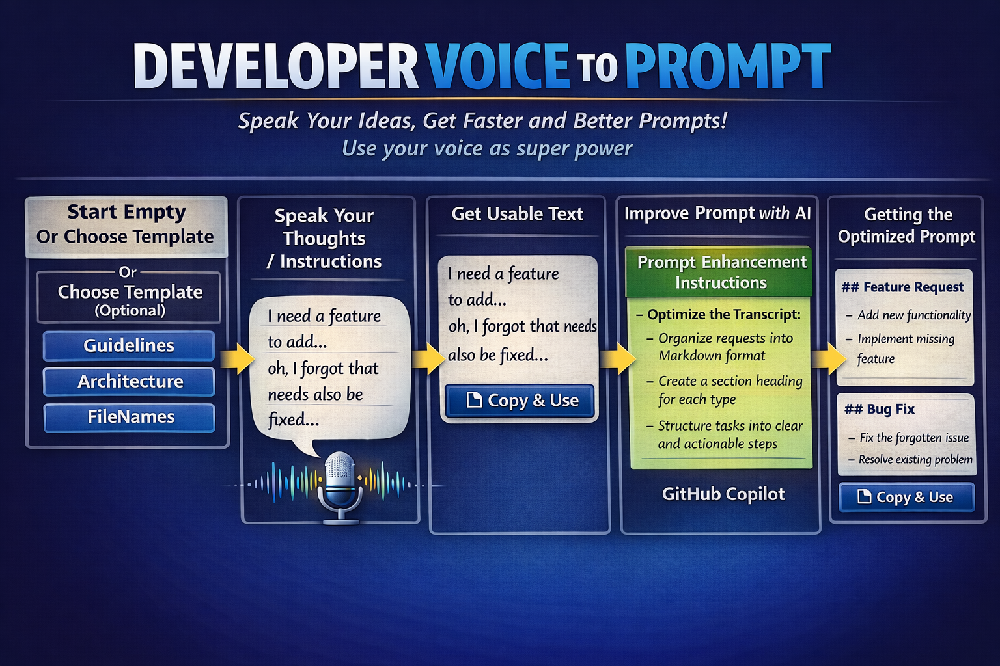

## Why This Exists

Prompting is now part of daily development work, but the input experience is fragmented.

- Some AI tools have voice input.
- Many do not.
- Some workflows need reusable prompt structure, exact file names, or tool names.
- Switching between dictation tools, editors, and AI clients breaks flow.

Developer Voice to Prompt gives you a single voice-first workflow that stays useful even when you switch models, IDEs, or AI tools.

## Built For Developers

This app is aimed at developers who want to:

- capture implementation ideas before they disappear
- fill reusable prompt templates with exact file names, modules, or tool names
- refine bug reports, refactoring requests, and architecture prompts by voice
- keep a reusable prompt history outside any one AI product
- provide voice input to MCP-aware tools without depending on their built-in dictation UX

## Core Workflows

### Speak, Edit, Continue

Start speaking and the transcript appears live. If you notice something wrong, edit the text directly and continue speaking without restarting the session.

<a href="doc/images/MainWindow.png">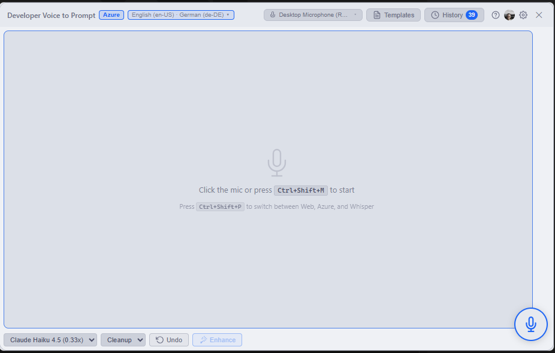</a>
<a href="doc/images/MainWindowRecording.png"></a>

### Reuse Prompt Templates

Templates let you keep the parts that should stay stable while changing only the details that matter for the current task.

Typical template fields developers fill in by voice:

- file names
- module names
- affected components
- MCP tool names
- agent or skill names
- acceptance criteria

This is especially useful when the target AI tool searches your codebase and performs better with exact names.

<a href="doc/images/MainWindowTemplates1.png">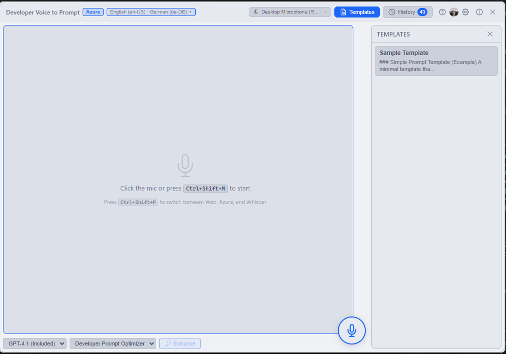</a>
<a href="doc/images/MainWindowTemplates2.png">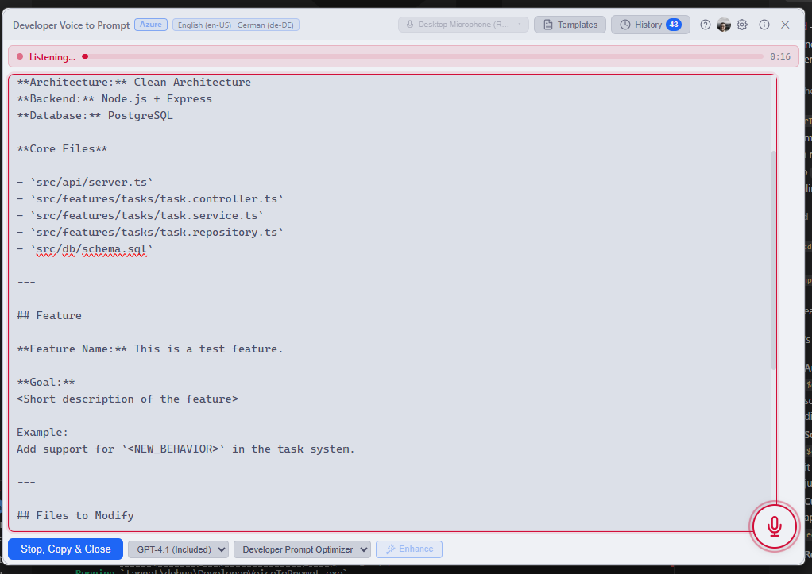</a>

### Keep Your Prompt History

Every prompt is stored locally so you can search, reuse, refine, or delete it later. That history belongs to your workflow, not to a single AI product.

<a href="doc/images/MainWindowHistory.png"></a>

### Enhance Rough Dictation Into Better Prompts

If you connect GitHub Copilot, raw dictation can be transformed into a cleaner, more structured prompt based on your own enhancement instructions.

Use this when you want to turn a rough stream of thoughts into something closer to:

- a bug investigation brief
- a refactoring request
- a feature implementation plan
- an agent instruction block
- a review or debugging prompt

<a href="doc/images/SettingsGithubCopilot.png">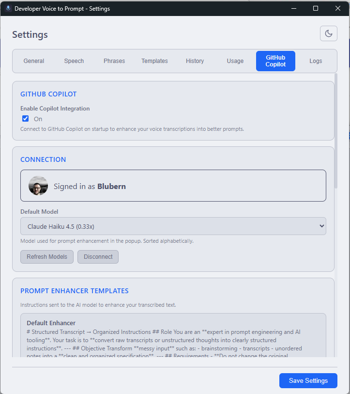</a>

## MCP Server For Voice Input

Developer Voice to Prompt can also run as a local MCP server.

That means MCP-capable tools can ask this app for voice input, open the popup, show the reason they need input, and wait for you to speak or type the answer. This is useful when your AI client supports MCP tools but has weak or no native dictation support.

### What It Does

- runs a local HTTP MCP server on `localhost`
- exposes a `voice_to_text` tool
- opens the popup when a client requests voice input
- shows the request reason in the popup so you know what the AI is asking for
- optionally pre-fills context text that you can edit before submitting
- returns the final text back to the calling MCP client

### Typical Use Cases

- answer an agent's follow-up question without typing
- dictate missing implementation details into an MCP-driven workflow
- speak a bug reproduction description when the agent asks for clarification
- capture architecture context for an AI tool that can call MCP tools but has no voice UI

### Setup

1. Open Settings.
2. Enable the MCP server in General.
3. Choose the local port.
4. Save settings.
5. Add the local server URL to your MCP-capable client.

The server is disabled by default until you enable it and save.

<a href="doc/images/McpSettings.png">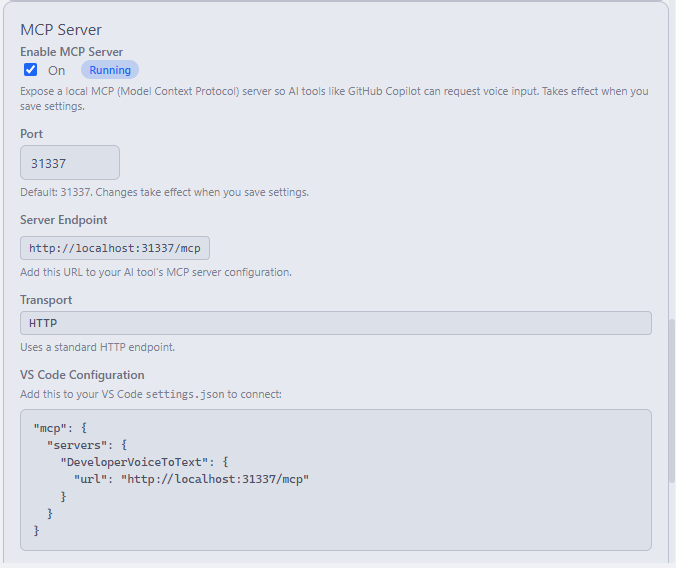</a>

The app exposes a local `voice_to_text` MCP tool that other tools can call.

<a href="doc/images/McpTools.png">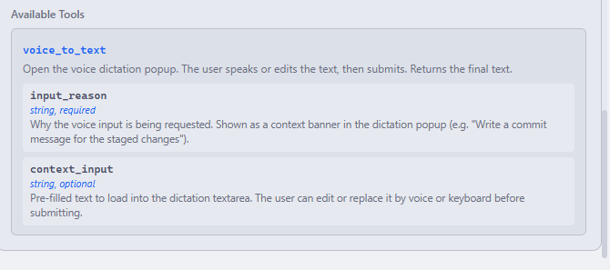</a>

One example is registering the local server in GitHub Copilot, but the feature is not limited to Copilot. Any same-machine MCP client that can talk to a local HTTP MCP server can use it.

<a href="doc/images/GithubCopilotAddMcpServer.png">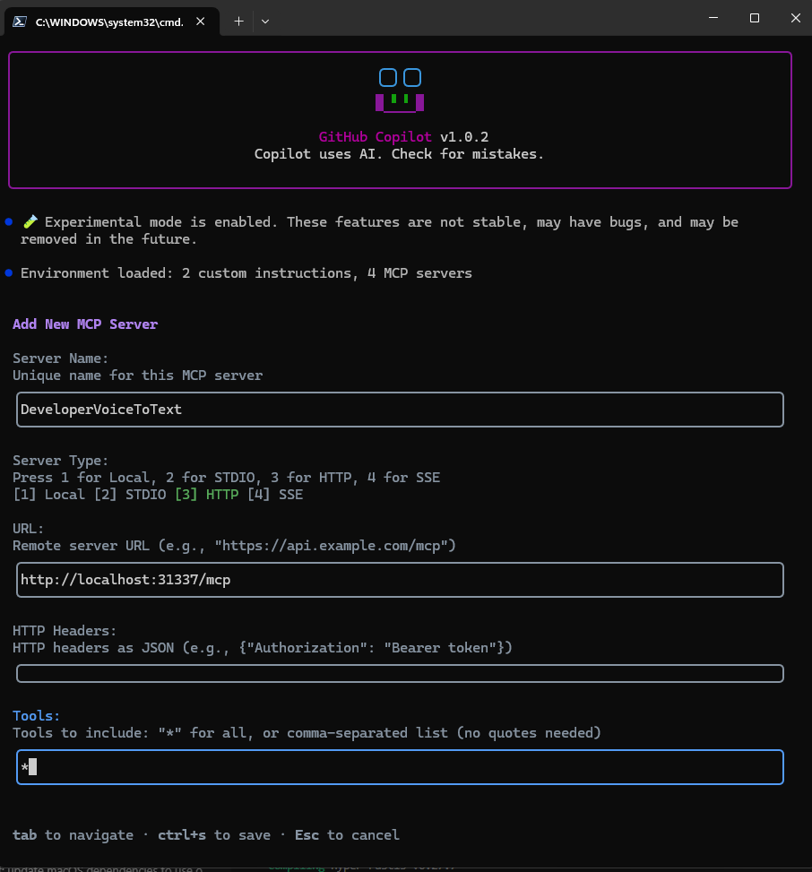</a>

Sample with GitHub Copilot: when Copilot calls the tool, the popup shows the request context so you can answer with voice or typed edits and send the result back to the caller.

<a href="doc/images/GithubCopilotaAskMeSomethingVoiceInput.png">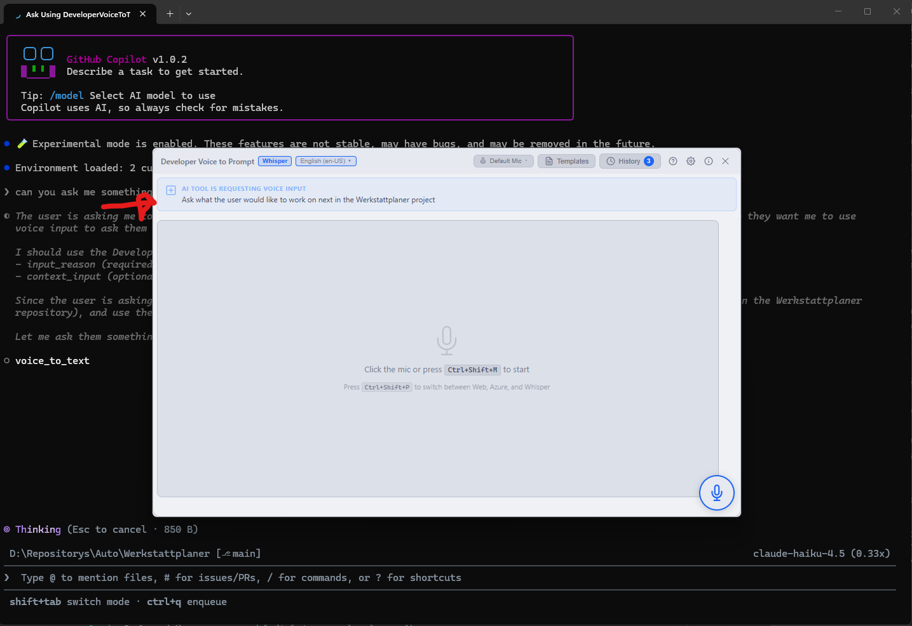</a>

### Current MCP Behavior

These points reflect the current implementation:

- local only: the server binds to `127.0.0.1`
- one request at a time: concurrent dictation requests are rejected
- timeout: pending requests time out after 5 minutes if nothing is submitted
- cancel on close: closing the popup cancels the MCP request
- configurable port: set it in Settings
- no authentication layer: intended for trusted local workflows

## Speech Engines

Choose the engine that matches your workflow.

| Feature | Web Speech | Azure | Whisper |
| --- | :---: | :---: | :---: |
| Real-time transcription | ✅ | ✅ | ❌ |
| Editable while speaking | ✅ | ✅ | ✅[^1] |
| Auto-punctuation | ❌ | ✅ | ✅ |
| Multi-language mixing | ❌ | ✅ | ❌ |
| Custom phrase boost | ❌ | ✅ | ✅ |
| Silence auto-stop | ✅ | ✅ | ✅ |
| Microphone selection | ✅ | ✅ | ✅ |
| Zero setup | ✅ | ❌ | ❌ |
| Local offline use | :question:[^2] | ❌ | ✅ |

[^1]: Whisper is not true real-time transcription, so some latency can occur while speaking.
[^2]: Web Speech can be local or cloud-backed depending on the platform WebView implementation.

Azure is especially useful when your spoken language and your technical vocabulary do not match cleanly, for example when you speak one language but say English framework names, class names, or code terms.

| Switch language |
| :---: |
| <a href="doc/images/MainWindowEasyLanguageSwitch.png">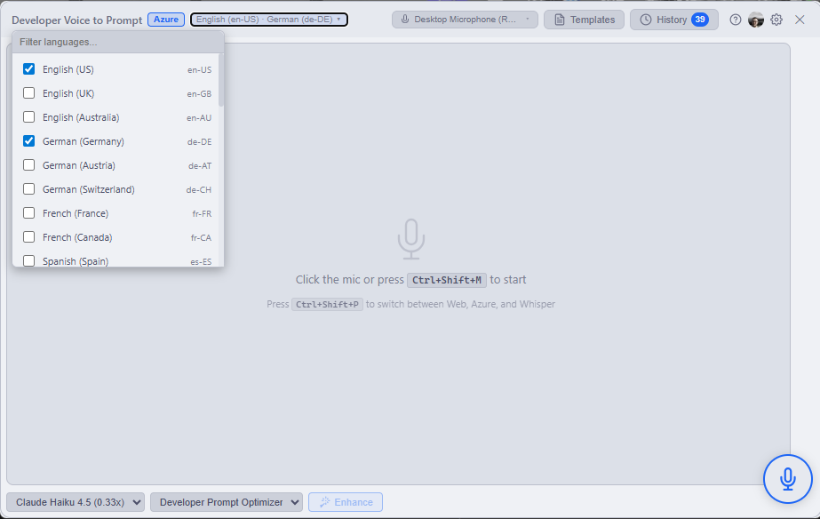</a> <a href="doc/images/MainWindowEasyLanguageSwitch1.png">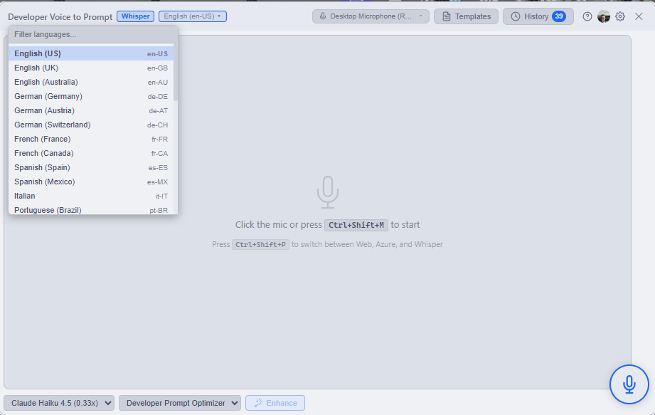</a> |

## Typical Workflow

1. Open the popup with your global shortcut.
2. Optionally load a template.
3. Speak your prompt, idea, or answer.
4. Edit while speaking if needed.
5. Copy the result into your AI tool, or submit it back to an MCP client.
6. Optionally run prompt enhancement if you use Copilot.

## Requirements

### What Works Immediately

The app works out of the box with Web Speech.

- no developer account required
- no API key required
- no paid plan required

That makes it the fastest way to start using the app.

### Optional Upgrades

| Capability | What you need | Why you would use it |
| --- | --- | --- |
| Azure Speech | Azure Speech key and region, free tier available | Better speech recognition, punctuation, phrase boosting, multi-language scenarios |
| Whisper local | Download a model in Settings | Local offline transcription and privacy |
| Prompt enhancement | GitHub Copilot CLI plus a Copilot plan, including free tier options | Turn rough dictation into cleaner prompts |
| MCP voice input | An MCP-capable client running on the same machine | Let AI tools request voice input through the popup |

Without Azure, Whisper, Copilot, or MCP, the app is still useful as a standalone dictation and prompt-template tool.

## Downloads

[](https://github.com/Blubern/DevloperVoiceToPrompt/actions/workflows/release.yml)

| Platform | Download |
| --- | --- |
| Windows | [Latest installer](https://github.com/Blubern/DevloperVoiceToPrompt/releases/latest) |
| macOS | [Latest DMG](https://github.com/Blubern/DevloperVoiceToPrompt/releases/latest) |

All releases are listed on the [Releases page](https://github.com/Blubern/DevloperVoiceToPrompt/releases).

## macOS Install Note

If macOS shows a message like `Developer Voice to Prompt is damaged and can't be opened`, that is Gatekeeper blocking an app that is not yet code-signed and notarized by Apple.

Use this sequence:

1. Download the DMG.
2. Drag the app into Applications.
3. Try to open it once.
4. If macOS blocks it, run:

```bash
xattr -cr "/Applications/Developer Voice to Prompt.app"
```

If you have not copied the app to Applications yet and are trying to launch it directly from the mounted DMG, use the mounted path instead:

```bash
xattr -cr "/Volumes/Developer Voice to Prompt/Developer Voice to Prompt.app"
```

Then open the app again. This is a one-time step for that downloaded copy.

## Keyboard Shortcuts

All shortcuts are customizable in Settings.

| Action | Windows | macOS |
| --- | --- | --- |
| Show or hide popup | `Ctrl+Alt+V` | `Cmd+Alt+V` |
| Start or stop voice | `Ctrl+Shift+M` | `Cmd+Shift+M` |
| Copy and close | `Ctrl+Enter` | `Cmd+Enter` |
| Switch speech provider | `Ctrl+Shift+P` | `Cmd+Shift+P` |
| Enhance prompt | `Ctrl+Shift+E` | `Cmd+Shift+E` |
| Dismiss | `Esc` | `Esc` |

Press `?` in the popup to see active shortcuts.

## Developer Docs

If you want to build from source, understand the architecture, or work on the project itself, see [DEVELOPMENT.md](DEVELOPMENT.md).

## License

MIT